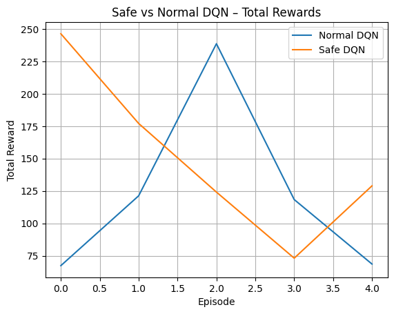

# RL_Project _ Autonomous Driving

## Project Overview

This project aims to implement, train, and evaluate reinforcement learning agents in simulated road environments using the [`highway-env`](http://highway-env.farama.org/) framework.

The goal is to explore how RL agents can be trained to navigate safely and efficiently through various road scenarios such as highways and intersections, using both **discrete** and **continuous** action spaces. We also integrate a third scenario trained with **Stable-Baselines3**.

## Team Members

- Meziany Imane
- Yakhou Yousra
- Zuo Yuxian

---

## Environments and Scenarios

### 1. Task 1: Pre-specified Environment : **Highway with Discrete Actions**

- **Config file**: `config.py`
- **Observation type**: `OccupancyGrid`
- **Action type**: `DiscreteMetaAction`
- **Vehicles**: 15
- **Duration**: 60s
- **Reward shaping**:

  - Collision: -1
  - High speed: +0.1
  - Right lane: +0.5
- **Objective**: Train a car to drive in highway conditions with discrete actions and document learning behavior.

### 2. **Highway with Continuous Actions**

- **Config file**: `highway_continuous_config.py`
- **Observation type**: `Kinematics`
- **Action type**: `ContinuousAction`
- **Objective**: Analyze how agent behavior and learning differ when using continuous actions.

### 3. **Intersection Navigation**

- **Config file**: `intersection_config.py`
- **Observation type**: `Kinematics`
- **Action type**: `DiscreteMetaAction`
- **Vehicles**: 10
- **Duration**: 60s
- **Objective**: Leverage off-the-shelf RL agents for training in a more complex urban setting.

## Task 4 – Extra Experiment

This section explores various behaviors and limitations of the DQN algorithm within the `highway-env` simulation framework. The experiments are based on the open-ended questions from the project instructions and aim to highlight key reinforcement learning properties such as robustness, generalization, safety, and multi-agent behavior.

### 1. Impact of Hyperparameters on Performance

We evaluated four different learning rates by training separate DQN agents for each setting. Each model was evaluated over 5 episodes.

| Learning Rate | Average Reward |
|---------------|----------------|
| 1e-4          | 27.27          |
| 5e-4          | 27.67          |
| 1e-3          | 26.27          |
| 5e-3          | 27.27          |

**Conclusion**: The performance was stable, suggesting robustness to learning rate changes.

**Reward vs Learning Rate**  

### 2. Generalization to Other Environments

**(a) Modified Parameters**: The model was tested in a modified version of `highway-v0` (3 lanes, more vehicles, altered rewards).

- Mean reward: 282.58  
- Result: Stable behavior without retraining

**(b) Environment Change - `merge-v0`**: The same model was tested in `merge-v0`. It did not crash but failed to complete episodes or engage meaningfully.

**Conclusion**: The agent generalizes well when parameters are modified, but fails to adapt to structurally new environments.

**Reward in Modified Config**  

**No progress in merge-v0**  

### 3. Safe Reinforcement Learning

A new DQN agent was trained using a reward structure that penalizes collisions and lane changes while encouraging right-lane driving.

| Model       | Avg Reward | Collisions |
|-------------|-------------|------------|
| Normal DQN | 122.85      | 5/5        |
| Safe DQN   | 149.93      | 5/5        |

**Conclusion**: The safer agent obtained better rewards, but did not reduce collision frequency.

**Safe vs Normal Rewards**  

### 4. Implicit Prediction of MDP Outcomes

We visually inspected episodes to determine whether the agent anticipated dangers before reacting.

| Episode | Situation                  | Behavior   | Notes               |
|---------|-----------------------------|------------|---------------------|
| 1       | Slower car ahead            | Reactive   | Braked too late     |
| 2       | Merge zone                  | Anticipate | Changed lane early  |
| 3       | Congestion in right lane    | Reactive   | Didn't avoid crowd  |

**Conclusion**: Some behaviors suggest anticipation, though the agent is mostly reactive.

### 5. Multi-Agent Control (Simplified)

We increased traffic to simulate a multi-agent scenario and let a single-agent DQN model operate in a crowded environment.

| Episode | Steps Survived |
|---------|----------------|
| 1       | 27             |
| 2       | 33             |
| 3       | 32             |

**Conclusion**: The agent handled brief survival but failed to adapt or coordinate with other traffic agents.

**Single-Agent Performance in Dense Traffic**  

---

### Summary of Observations

- Robustness to learning rate variation was observed.
- Generalization works well across parameter changes, but not across structure.
- Safety-based reward shaping improved reward but not collisions.
- Implicit prediction of environment dynamics may be emerging.
- A DQN model trained on single-agent tasks fails to generalize to multi-agent situations.

---

## Files Description

| File                              | Description                                         |
| --------------------------------- | --------------------------------------------------- |
| `config.py`                     | Task 1 environment: highway with discrete actions   |
| `highway_continuous_config.py`  | Task 2 environment: highway with continuous actions |
| `intersection_config.py`        | Task 3 environment: intersection with SB3 agent     |
| `config.pkl`                    | Serialized config for discrete highway scenario     |
| `highway_continuous_config.pkl` | Serialized config for continuous highway control    |
| `intersection_config.pkl`       | Serialized config for intersection scenario         |
| `RL_project.ipynb`              | Main training notebook implementing all tasks       |
| `README.md`                     | Project documentation                               |

---

## Task1 - DQN

- `Task1_highway_dqn.ipynb`: Main notebook for Task 1, where a DQN agent is trained.
- `gridsearch_dqn_results.pkl`: Contains grid search results for hyperparameter tuning.

---

## Task2_ppo - PPO

- `Task2_continuous_ppo.ipynb`: Main notebook for training and evaluating the PPO agent.
- `PPOContinuous.py`: Defines the PPOContinuous class and training logic for continuous control.
- `net.py`: Contains the actor and critic neural network architectures used by the PPO agent.
- `runs/`: TensorBoard logs for monitoring training progress.
- `ppo_checkpoints/`: Saves the best agent from each experiment (based on highest evaluation reward).
- `plot_runs/`: Contains data exported from TensorBoard for plotting evaluation rewards during training.

---

## Other Files

- `env_test.ipynb`: Used for testing the environment setup.

---

## Notes for task1 and task2_ppo

- Ensure TensorBoard is installed (`pip install tensorboard`) to visualize training logs inside the `runs/` folder.
- All notebooks are designed to run on GPU if available.

---